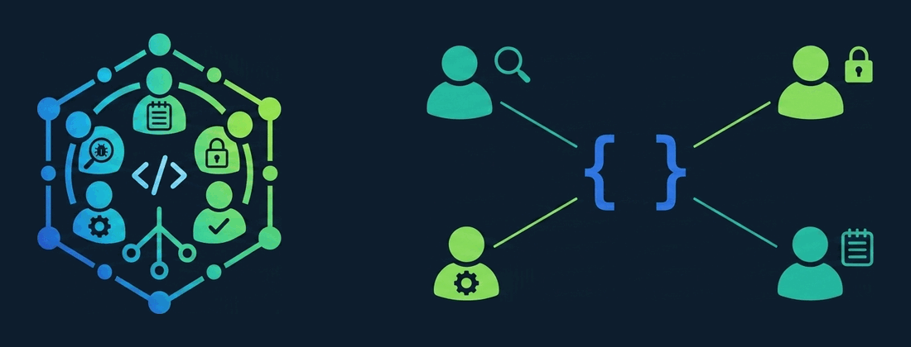

<p align="center">
  
</p>

# Code Review Cadre

**Every AI reviewer has a blind spot. They do not all have the SAME one.**

Cadre puts several models on the same diff, grades them against real bugs from
your own git history, and tells you which combination to keep. Not which one
scores highest. Which ones fail in DIFFERENT places.

You probably have four or five coding agent CLIs installed and you use one at a
time. Each is good. Each has a blind spot, and it is not random: it comes from
the model family underneath. Run three reviewers that share a lineage and you
bought one opinion three times.

## The output is a roster, not a leaderboard

```
CANDIDATE                   K1      K2      K3
stubA                       HIT     MISS    MISS
stubB                       MISS    HIT     MISS

★ NOTHING in this lineup catches: K3
```

That last line is the product. Two candidates that each hit half the key make a
better panel than two that hit the same half, and the gap tells you what kind of
reviewer you are still missing.

What you want from reviewer number four is not a better score. It is a DIFFERENT
set of failures.

Cadre exists to measure that on **your** repo, because the number that decides
your panel is not a number anyone else can publish for you. What it found on the
private repo it was built for: a candidate that scored 4 of 6 blocking items,
worse than every incumbent, still earned a seat — it caught a bug all three
incumbents missed across six runs, in both of its own, and the only thing
distinguishing it was lineage. That is one candidate on one repo, not a sample
size. It is also exactly the result a leaderboard cannot produce.

The largest public measurement points the same way. Tony Stone's
[A Single LLM Is an Incomplete Code Reviewer](https://doi.org/10.5281/zenodo.21328807)
(v2) scored 294 confirmed defects across 15 model versions from 8 providers, and
found **56.8% caught by exactly one model**, with coverage running 47% at one
reviewer, 72% at two and 89% at three, no large-sample model exceeding 61%
recall.

Treat that as a direction, not as your number, and not as this tool's result. It
is a preprint: one team, one codebase, LLM-drafted answer keys with the conflict
disclosed. Its saturation curve also counts REVIEWERS rather than lineages, and
six of its eight providers still owned defects no other provider found — so a
fourth chair from a family you don't have is not the same purchase as a fourth
chair. Cadre does not inherit those numbers and does not reproduce them; it
gives you the apparatus to find out what your own curve looks like.

The pairing literature points the same way from the other side.
[Cross-Model LLM Code Review](https://arxiv.org/abs/2607.21656) (Xiang et al.,
2026) had two agents draft and review for each other across 116 tasks: the
stronger model reviewing the weaker raised pass rates 71.6% → 89.7%, the
reverse ordering **lowered** them 91.4% → 82.8%, and the stronger model
reviewing its own drafts bought nothing. Their reviewer rewrites the draft
where Cadre's seats only report, so the numbers don't transfer — but the shape
does: who should review whom is an empirical question with an asymmetric
answer, not a leaderboard lookup.

## What Cadre actually does

- **Mines your history for real bugs.** Finds commits where the author broke
  something and repaired it right after, and keeps only the pairs where the fix
  also touched a test. The answer key is what shipped, not a model's opinion.
- **Grades HIT, DEFER, MISS.** A reviewer that found the bug and argued it was
  fine is worse than one that missed it, and Cadre disqualifies it outright.
- **Staffs the panel.** `cadre panel` prints the coverage matrix above and names
  the items nothing in your lineup catches.
- **Refuses to leak the answers.** Truncated clones, keys outside the tree, a
  credential preflight that stops the run. These are behaviours, not advice.
- **Runs anything.** One adapter file per CLI, and any model on a multi-provider
  CLI is already a valid candidate with no code at all.

## Build a whole panel for free

You do not need a single paid subscription to run this. You need a reviewer and
a judge, and there is a free option for both.

**Reviewer: [CodeRabbit](https://www.coderabbit.ai/).** Three reviews an hour on
the free tier, which is more than a benchmark pass needs, and it is a real
reviewer rather than a demo. If you are not in the Claude or OpenAI ecosystem
and have no interest in joining, start here. The adapter is
[`agents.d/coderabbit.sh`](agents.d/coderabbit.sh) and it ships working.

Real credit to the CodeRabbit team ([coderabbit.ai](https://www.coderabbit.ai/),
[github.com/coderabbitai](https://github.com/coderabbitai)) for putting a usable
free tier on a paid product. It is the reason this tool has an answer for
someone with no budget, and that answer would otherwise be "sorry."

**Judge: any free model.** The judge reads a review and a key and returns JSON.
It does not need a frontier model. `CADRE_JUDGE` takes the same
`agent:provider/model` spec a candidate does:

```bash
export CADRE_JUDGE=opencode:cerebras/gpt-oss-120b
cadre run coderabbit 2
```

**Use two of them.** `CADRE_JUDGE` takes a comma-separated pair, and both grade
every run:

```bash
export CADRE_JUDGE='opencode:cerebras/gpt-oss-120b,opencode:ollama/qwen3-judge'
```

An item they agree on is the grade. An item they **split** on is `UNRESOLVED`:
it scores nothing, and the report states a range instead of a number. This is
not belt-and-braces. Measured here, two graders over the same nine reviews split
on **one item in three**, and three readers scored one candidate 2/6, 4/6 and
6/6 ordered by nothing but leniency — so a single judge's reading is a
hypothesis about a candidate, not a measurement of it.

There is deliberately no tie-break, because a tie-break makes one grader
authoritative for exactly the items where graders are least reliable. And a
split is a finding about your **key**, not about either judge: it says the key's
credit boundary does not decide that item. The report prints both readings side
by side so you can tell which fix it needs — judges quoting different sentences
means the boundary is loose, quoting the same sentence two ways means the
wording is ambiguous. Tighten the key, then re-grade.

Judges are free, so the second one usually costs nothing but wall time. One
judge still works; the report just says out loud that it is one reading.

### Free tiers worth pointing Cadre at

Rate limits as of July 2026. They move, so check the provider before you plan
around a number.

| Provider | Free tier | Notes for this tool |
|---|---|---|
| [Cerebras](https://inference.cerebras.ai/) | 1M tokens/day, ~30 req/min | Very fast, and verified working **as a judge**. ★ As a *reviewer* through `opencode` it currently hard-fails: the second assistant turn after a tool call is rejected with `reasoning_content ... unsupported`. Judge only, for now. |
| [Groq](https://console.groq.com/) | ~30 req/min, ~6K tokens/min | Fastest free inference. The low TPM is the binding constraint, not the request count. |
| [Mistral](https://console.mistral.ai/) | 1 req/sec, 500K tokens/min, 1B tokens/month | Most generous by volume, and Codestral is a code model. Also what the shipped `vibe` adapter uses. |
| [OpenRouter](https://openrouter.ai/) | ~20 req/min per model, ~30 free models | One key, many lineages. The cheapest way to reach a model family you do not have. |
| [Google Gemini](https://aistudio.google.com/) | 10-15 req/min, ~1,500 req/day | Flash tier is plenty for a judge. |
| [GitHub Models](https://github.com/marketplace/models) | 50 req/day high tier, 150 mini, 8K in / 4K out | Lowest ceiling here, but you may already have it. |

Reaching any of them is an `opencode` provider entry plus one key, and then they
are ordinary specs: `opencode:cerebras/gpt-oss-120b`. No adapter needed. See
[opencode's provider docs](https://opencode.ai/docs/providers).

**Or judge locally, and pay nobody.** Point an `opencode` provider at Ollama's
OpenAI-compatible endpoint and the judge never leaves your network. In
`~/.config/opencode/opencode.json`, with no API key because Ollama wants none:

```json
{ "provider": { "ollama": {
    "npm": "@ai-sdk/openai-compatible",
    "name": "Local Ollama",
    "options": { "baseURL": "http://localhost:11434/v1" },
    "models": {
      "qwen3-judge": {
        "name": "qwen3:14b judge (local)",
        "limit": { "context": 24576, "output": 8192 }
      }
    }
} } }
```

```bash
export CADRE_JUDGE=opencode:ollama/qwen3-judge
```

Measured on a 12GB RTX 3060 with `qwen3:14b`: two runs over the same review,
135s and 159s, both returning the identical grade. Against a couple of seconds
from a hosted free tier that is slow, but the judge grades a review rather than
writing one, and it runs once per review. Slow is affordable here.

★ **Raise `num_ctx` first.** Ollama defaults to roughly 4K, which silently
truncates the rubric before the review is even read, and you get confident
nonsense rather than an error. The OpenAI-compatible endpoint has no way to set
it per request, so bake it into a derived model once:

```bash
printf 'FROM qwen3:14b\nPARAMETER num_ctx 24576\nPARAMETER temperature 0\n' > Modelfile
ollama create qwen3-judge -f Modelfile
```

Temperature 0 because grading is bookkeeping and you want the same review to
score the same way twice.

**Free tiers are the cheapest route to the thing that actually matters here: a
model lineage you do not already have.** Four free models from four families
beat two paid ones from the same lab.

Two caveats before they bite you. CodeRabbit **cannot be your judge**, since it
ships its own review contract and takes no prompt, so it has nothing to grade
with. And it gets a different brief from everyone else for that same reason,
which is worth remembering when you read its row in the matrix.

### If you DO pay for several

Then you are already buying the seats and using one at a time. Cadre puts them
all on the same diff and tells you which combination earns its keep, and which
one you are paying for twice under different branding.

## Quick start

For the optional Pi SDK reviewer and its frozen comparison corpus, see
[Pi review adapter and matched evaluation](docs/PI-REVIEW.md).

```bash
git clone https://github.com/VibeCodyH/code-review-cadre ~/code-review-cadre
export PATH="$HOME/code-review-cadre/bin:$PATH"

cadre doctor                      # what's installed, what's missing
cadre setup ~/my-repo             # mine (target, fix) commit pairs
cadre make-pass login-race ~/my-repo <target-sha> <fix-sha>
$EDITOR ~/.local/state/cadre/keys/login-race.md    # read and fix the draft key
cadre add-pass login-race
cadre run codex 2                 # run it, grade it, get a slot
cadre panel                       # compare everything graded, staff the team
```

You need `git`, `jq`, `awk`, GNU coreutils, bash 4.4+, and at least two agent
CLIs. One to review, one to judge. Neither has to be paid.

`$EDITOR` on line four is not optional and not automatable. A key a model wrote
and a model grades measures agreement with the model, so you read the draft
before the pass will register. The setup step needs a human. `cadre run` after
it does not.

`cadre setup ~/my-repo --verify` optionally runs each shortlisted fix's tests
twice: once at the fix, then on a fresh copy with only its source changes
reverted and its tests retained. `verified` means the first command passed and
the second failed. Rows that cannot establish that stay `unverified` (or
`no-test-cmd`); they are not dropped. Review the saved logs before accepting a
key: a failure can still be environmental, and one green/red pair does not
establish that a suite is free of flakes or that the blamed target introduced
the bug.

**Verification executes repository code on your machine, without a sandbox.**
Test scripts can access your environment and network. It is off by default;
`CADRE_VERIFY_PAIRS=1` also enables it. Both copies live temporarily under
`CADRE_WORK`, outside the source repo and `CADRE_HOME`. Cadre does not install
dependencies. Use `CADRE_TEST_CMD` to override the detected full-suite command
and `CADRE_VERIFY_TIMEOUT` to change the 120-second limit per arm. Timeouts,
signals, and command launch errors never count as proof. Commands, exit codes,
logs, and the source-revert patch stay in `CADRE_HOME/verification/`.

## Where the answer key comes from

Not from a model's opinion. From what the author actually fixed next.

The miner looks for commits where B repairs A, blames the exact lines B changed,
and keeps the pair only when the fix ALSO touched a test. That last filter did
more for quality than everything else put together. An author who writes a test
next to the repair is telling you the bug was real, reproducible, and possible
to describe. Which is the same as saying it's possible to grade.

Most `fix:` commits don't survive that. On a real repo the raw yield was almost
all type checker and CI repairs. You can't grade a reviewer on "the compiler was
unhappy."

`cadre make-pass` uses a model to DRAFT the key off the fix commit, because
transcribing a diff into a rubric is tedious work. Then it refuses to register
the pass until you've read the draft and deleted the marker.

## HIT, DEFER, MISS

Every key item gets one of three grades:

- HIT. Found the bug and called it a problem.
- DEFER. Found the bug and said it was fine.
- MISS. Never saw it.

Most benchmarks fold DEFER into MISS, since either way the bug ships. That's the
wrong call.

A reviewer that missed the bug is limited. A reviewer that found the bug and
argued it was intentional is dangerous, and it argues WELL, usually by quoting
the code's own comment or a test that asserts the broken behavior as correct. In
a panel, that's worse than saying nothing. It talks the other reviewers out of a
real finding and it brings a citation.

So a DEFER on a blocking item disqualifies a candidate outright, whatever its
hit rate. That's not a tunable weight. One confident wrong approval on a data
loss bug costs more than a hundred missed nits save.

## Staffing the panel

`cadre run` grades one candidate and gives it a seat: can review alone, needs a
second reader, or do
not slot. `cadre panel` staffs the team, reading every candidate you've graded
and printing the coverage matrix at the top of this page.

On the private repo this was built for, a candidate hit 4 of 6 blocking items,
worse than every incumbent, and got slotted anyway. It found a live bug all
three incumbents missed across six runs, on both of its own runs. The only thing
different about it was the model family.

So read the per item rows in the report, not the totals. And when you add a
chair, add a LINEAGE you don't already have. A different wrapper over the same
underlying family is not a fourth opinion. Some review products are front ends
over the same two or three models, so check the vendor's own docs.

The catch, and it's real: the decorrelated one is usually noisier. That
candidate went in as SECONDARY. Never run alone, and a clean pass from it
doesn't mean anything, because it produced one on a commit it had called
blocking the run before. Same checkout, same prompt.

## Then actually use it: `cadre review`

Everything above is the setup. The benchmark tells you who to seat; `cadre
review` seats them.

```bash
cadre panel --save                 # writes $CADRE_HOME/roster, all commented
$EDITOR ~/.local/state/cadre/roster    # uncomment your lineup
cadre review                       # run it against what you're about to ship
```

`cadre review` diffs your working tree against the merge-base with the default
branch, hands that change to every reviewer on the roster, and writes each
review plus a combined `report.md`. `--base <rev>` picks a different base,
`--roster a,b,c` skips the file, `--synth <agent-spec>` merges the reviews into
one document that tags each finding with **which** reviewers raised it.

For a project default, put the same roster syntax in `.cadre/roster` at the
target repository's root. Selection is `--roster`, then `$CADRE_ROSTER`, then
the project's `.cadre/roster`, then `$CADRE_HOME/roster`. The report records
which source supplied the roster. See [roster resolution](docs/CLI-REFERENCE.md#cadre-review-roster-gates)
for target lookup and validation rules.

### Optional seats: roster gates

A roster line can reserve a seat for changes that justify its cost:

```
codex ?min-lines=200
opencode:meta/muse-spark-1.1 ?min-files=5 ?untested
claude ?paths=auth/
```

`?min-lines=N` requires at least N added plus deleted lines, `?min-files=N`
requires at least N touched files, and `?untested` requires a non-test change
with no test file in the diff. Gates on one line are ANDed. The test-file rule
is deliberately crude: any basename or directory segment containing `test` or
`spec`, case-insensitively, counts as a test file.

`?paths=TEXT` requires a changed repository-relative path containing that
literal, case-sensitive substring. Renames check both names. This lets you
reserve a seat for paths such as `auth/` or `migrations/`; it does not detect
whether a change is security-sensitive.

A small diff should not pay the full panel price, but the gate is yours, not
cadre's. `--all-seats` runs every seat anyway. `--full` also runs every gated
seat because there is no diff to measure, and says that gates do not apply in
the report.

That attribution is the point. "3 of 3 flagged this" and "only the second reader
flagged this" are different facts, and the second one is why you staffed a
panel instead of buying the highest scorer.

### Reviewing something that isn't a diff

A diff is the common case, not the only one. `--full` points the same roster at
whatever you name, and reviews it as it stands:

```bash
cadre review --full                     # this whole repo, as it is
cadre review --full ./src/billing       # one subdirectory
cadre review --full ~/handoff/vendor-sdk # a directory that isn't a repo
cadre review --full ./docs/RUNBOOK.md   # a single file
```

`--full` and `--base` are opposites and cadre refuses both at once. The
reviewers get a different brief — one told to review a change reports on volume,
so pointed at a whole tree under the diff brief it treats every file as new work
and inflates accordingly.

Two things worth knowing, because this mode shows reviewers *more* than a diff
review does:

- **`.gitignore` is honoured even when the target is not a repo.** An ignored
  file is not merely kept out of the diff, it is removed from the directory the
  reviewers run in — otherwise it would sit there readable, and the credential
  check skips ignored files by design.
- **There is a size ceiling.** Every reviewer on the roster reads all of it, so
  a target is a bill as much as a review. Over 2000 files or 20MB cadre refuses
  and names the biggest directories, which is almost always a `node_modules` or
  a `vendor` you did not mean to include. `CADRE_TARGET_MAX_FILES` and
  `CADRE_TARGET_MAX_KB` raise it if you did.

The review directory records `files.txt`, the exact list the reviewers saw. The
checkout is a temp directory that gets deleted, so without that list nothing
afterwards would say what `--full ./docs` actually covered.

A few things it does deliberately:

- **It never runs a reviewer in your repo.** Each one gets its own disposable
  checkout built from `git stash create`, so your working tree is never the
  thing an auto-approving CLI is turned loose on. Several of these CLIs have no
  read-only mode and the brief invites them to run tests.
- **Your history never goes with it.** The checkout is a synthetic two-commit
  repository: the base tree, and the tree under review. A plain clone would
  carry every commit you ever made, and the credential check can only scan the
  tree that's checked out — so a `.env` committed once and deleted years ago
  passes the check and comes straight back out of `git log -p`. That was a real
  bug here, found by a panel run against this tool's own diff. Now there is no
  earlier history in the checkout to mine.
- **Uncommitted and untracked work is included**, because that is what you are
  about to ship. Gitignored files are not, so `.env.local` stays out.
- **A reviewer that fails is named in the report as FAILED.** Not omitted, not
  counted as clean. A panel of three where one died is a panel of two, and you
  should know which two.
- **Labels are single-use.** Re-running against changed code cannot hand you
  back the previous review.

### `--prerun`: the one reviewer that isn't a language model

Every model on your panel is wrong in correlated ways. A test suite isn't wrong
at all, and it has zero correlation with how the code was written, which makes
it the highest-leverage thing on the panel.

```bash
cadre review --prerun 'npm test' --base origin/main
```

That runs once, on a throwaway copy of the checkout, before any reviewer
starts. All of them get the same transcript: the command, the exit code, and
the tail of its output, with instructions to treat it as measured fact and to
speak up if a finding of theirs contradicts it. A panel that would otherwise
have called a red branch clean now has to argue with the exit code.

**It runs a command, so it is off unless you ask for it, and cadre will not
guess one.** Auto-detection exists for the *brief* and it emits templates like
`go test ./<pkg>` on purpose, because those are examples for a reviewer to
adapt. Turning a guess into something cadre executes would mean running
whatever a repo's `package.json` says on a diff you may not trust. The command
has to be one you typed.

The rest of the handling follows from that:

- It runs **after** the credential preflight. Nothing gets built in a tree that
  just failed the secrets check.
- It runs in a **copy that is deleted before any reviewer starts**, so a suite
  that compiles doesn't leave every reviewer diffing a tree that's been built
  in.
- A command that **can't be executed at all** (exit 126/127) stops the run.
  Handing a panel `exit 127` as though it were a test result is worse than
  measuring nothing.
- A **failing** suite does not stop the run. Reviewing a red branch is a normal
  thing to want, and the reviewers are told it's red.
- Timeout is 600s, `CADRE_PRERUN_TIMEOUT` to change it. A timeout is reported to
  the panel as a timeout, not as a pass.
- The manifest records the command and its exit code, because a report that
  says the suite passed is only checkable if you can see what ran.

`--jobs N` runs reviewers concurrently. It defaults to 1 because roster members
on the same provider share a rate limit; cadre warns when it spots two.

### A reviewer can half-finish or never start, so there are four states

```
4 reviewers: 2 ok, 1 degraded, 0 inconclusive, 1 failed
```

A model that runs out of tokens partway through hands you real findings about
the part it read, and no information at all about the rest. Cadre calls that
**degraded** and keeps it separate from both neighbours, because collapsing it
either way loses something:

- Counting it as **ok** is a bug that shipped here. Grok appends a `_TRUNCATED`
  marker *after* its partial text, the reject pattern did not match it, and half
  a review scored as a whole one.
- Counting it as **failed** is the overcorrection: it stops the overstatement by
  binning findings a reviewer actually produced.

So the partial review is kept (`<reviewer>.md.partial`), printed in full in the
report, and handed to the synthesizer under its own delimiter. What changes is
that **its silence stops counting.** A file it never reached is not cleared, and
it is not tallied as a dissenter on a finding it never saw — otherwise a
`[1/4]` tag reads as three reviewers disagreeing when it is one reviewer and two
absences. The silence rule also applies when `CADRE_SYNTH_MAX` truncates an
oversized review, because cutting a review at 40KB makes it silent past 40KB for
the same reason — but that reviewer gets its **own** delimiter, not the partial
one. It is healthy; cadre cut it. Telling the synthesizer a working reviewer
stopped early is a false statement about a model that can end up quoted in a
report, so the two causes stay separate even though the counting rule is shared.

Only the adapter can tell these apart — nothing downstream can distinguish an
empty answer from an empty failure — so the contract lives there, in
[docs/ADDING-AN-AGENT.md](docs/ADDING-AN-AGENT.md).

The fourth state is the one that has nothing to do with the adapter. A model can
exit 0, write 40KB, and never review anything — it summarises the diff, asks a
clarifying question, or echoes the patch back. `ok` used to mean "has content, no
marker, exit 0", which is not the same as "is a review", so those runs went into
the synthesis as complete reviewers: they inflated every finding's denominator
and their silence cleared every file they never mentioned. Cadre calls that
**inconclusive**, and the test is narrow on purpose — **no findings _and_ no
bottom line.** A review that states findings, or ends with a verdict, is `ok`
however thin it looks, because `findings=0` plus "ship it" is a real review and a
length floor threw exactly those away once. An inconclusive run is excluded from
the synthesis, never scored, and kept apart from `failed` in the report and in
`slots.tsv` — "the CLI broke" sends you to the adapter, "this model will not hold
the review contract" sends you to the roster, and they are not the same problem.

Measured, on the 26 review directories this repo was developed against: three
runs were scored `ok` while being a summary signed off with an emoji, a request
for clarification, and a parroted diff. Thirteen genuine zero-finding reviews all
stated a verdict and are untouched.

The check is loose about **how** a bottom line is phrased, and that is deliberate,
because the two ways it can be wrong are not symmetric. A phrasing it fails to
recognise files a real clean review as `inconclusive` and drops it from the
synthesis; a phrasing it recognises too readily leaves a non-review scored `ok`,
which is what every version before this one did anyway. So `no issues found`,
`LGTM`, `nothing to flag`, `safe to merge` and a bare `## Verdict` heading all
count, and the list is meant to grow. The cost of that choice, stated plainly: a
deflection that dresses itself as a bottom line — "Verdict: I cannot review this,
please clarify" — still passes. Catching *that* means reading the verdict for
meaning, which is the substance judgement the non-goal below is about.

**How much of this you actually get depends on your adapters.** `degraded` is
reachable only when an adapter emits the `_TRUNCATED` marker, and today that is
`grok` — it reads a `stopReason` from structured output, so it knows it stopped.
`codex` has the branch but cannot currently reach it: its `-o` file is
`--output-last-message`, written only at completion, so a killed run leaves it
empty and lands in `failed`. Every other shipped adapter reads plain stdout,
where a CLI killed mid-review is indistinguishable from one that crashed at the
start, and its partial text is discarded as `failed`. That is the safe
direction, not the useful one. If you want partial findings kept for a CLI you
care about, that is an adapter change, and it is the single highest-value
contribution to make here.

Two deliberate exceptions. A degraded run is **not scored** in a benchmark: a
number is a per-model claim and a run cut short is not a fair sample of the
model. And a degraded *synthesis* is treated as a failure, because the reviews
it was merging are already complete on disk and worth more than a partial merge.
The inconclusive check is also skipped for a synthesis, for a third reason: a
merge of a clean panel legitimately names no findings and gives no verdict of its
own — it reports each reviewer's — so applying the rule there would bin good
merges.

### Re-running without re-reading: `cadre settle`

Cadre reviews once and stops, so on its own it cannot put you on a treadmill.
Wrap it in a loop, which is the normal way to use a review tool on a branch that
is still moving, and every run re-raises the findings you already looked at and
decided against. The reviewers have no memory. You are the only thing that
remembers, and being the memory is what makes review loops unbearable.

So write down what you ruled on, in `$CADRE_HOME/ledger`:

```
L1 | wontfix  | timestamps are strings from neon-http, callers wrap them
L2 | accepted | missing test for the retry path, tracked in #412
```

Then split a review into what is genuinely new and what you have already
answered:

```bash
cadre settle .local/state/cadre/reviews/review-abc-1
```

```
NEW (2 of 3):
  - Migration exit code not checked in run.sh
  - Inconsistent import ordering in db.ts

already settled (1 of 3), shown so you can check the match:
  - [L1] Timestamps from neon-http are strings, comparing to Date fails
```

Settled findings are shown, not hidden, so you can catch a bad match. **It
exits 0 when nothing is new**, which is the part a wrapper wants: that is your
stopping rule, and it is a fact about what you have already decided rather than
a model's opinion about whether the code is good enough.

Two deliberate limits. **Nothing writes to the ledger but you.** A tool that
files its own dismissals will eventually dismiss something real, and the entire
value of the file is that a person decided. And the matcher errs toward NEW: a
finding it cannot confidently place is new, because showing you a duplicate
costs a second of reading while wrongly filing a live defect under a decision
you made about something else costs you the defect.

## When you hit a rate limit

Cadre expects this. A reply that looks like a rate-limit refusal is retried on
the **same** model with exponential backoff (`CADRE_RETRIES`, default 3, and
`CADRE_RETRY_WAIT`, default 60s doubling to a 600s cap). If it is still limited
it is recorded as a failed run, never as a review.

It will not fall back to a different model, and that is deliberate. Filing model
B's review under model A is the exact mislabeling this tool exists to catch. A
benchmark that quietly swaps the thing it is measuring is worse than one that
stops. The detector is length-guarded, so a real review OF a rate limiter that
says "429" and "quota exceeded" while quoting your code is not mistaken for a
refusal.

Budget the wall-clock: on defaults a run that stays limited costs about three
minutes before giving up. Each wait is printed, so it is not hung. On a tight
free tier, lower `CADRE_RETRIES` or run one reviewer at a time.

One adapter has a second, narrower retry. `agy`'s print stream sometimes ends
`status=ERROR` with a complete review already written, minutes inside every
clock. That is a transport flake, not a limit, so `agents.d/agy.sh` re-runs the
same model up to `CADRE_AGY_RETRIES` times (default 3) and records the count on
the run record as `adapter_attempts`. It never retries past cadre's timeout or agy's
own, and a refusal (which arrives as `SUCCESS` text) is never retried.

## It won't leak your answers or your secrets

If the key is "the bug the author fixed next," then the fix commit's subject line
states the answer, every reviewer has git, and some have web access. So:

- Graded passes run in a `--depth 2` clone pinned at the target, with `origin`
  removed. There's no future history to read and nothing to fetch it back from.
- Keys live outside the reviewed tree. `cadre doctor` exits non-zero on a pass
  where they aren't, and `cadre run` refuses that pass.
- Checkouts live outside the state directory entirely, because otherwise the
  agent's own working directory spells out where the keys are.
- The runner refuses when the output directory sits inside the checkout, or
  contains it. Otherwise reviewer #1's findings are one `ls` from the tree
  reviewer #2 reads, and you get contamination that looks exactly like agreement.
- Agents run with `CADRE_HOME`, `CADRE_WORK` and the rest of cadre's own
  variables stripped from their environment. `CADRE_WORK` especially: reviewer
  checkouts are siblings underneath it, so an agent that can read it is one
  `ls` from the tree another reviewer on the same panel is reading.
- A review that repeats two or more key headings word for word is flagged
  SUSPECT, excluded from scoring, and the whole pass is reported INVALID.
- Credential shaped files in the checkout stop the run before any agent starts.
  You're pointing auto approving CLIs at your source and some of them upload it.

**What that is not:** a sandbox. Several of these CLIs need full tool approval
to read the diff at all, so they can read your filesystem. Stripping the
environment stops the key being advertised. It doesn't stop an agent that goes
looking, and the verbatim check only catches copying, not paraphrase. Want a
real boundary, run them in a container with only the checkout mounted.

The credential check is narrower than it sounds, too. It works off a list of
known credential file *names* — `.env`, `*.pem`, `id_rsa` and friends stop the
run — plus a handful of config files (`.npmrc`, `.netrc`, `.pypirc`,
`.dockercfg`) where it also reads the contents, because the most common `.npmrc`
in the world is one harmless line and refusing on the name alone fails every
Node repo on its first run. Nothing else is read. An API key pasted into
`src/config.js` is a file called `config.js`, and it sails straight through. It
catches the obvious mistake and that is all it claims. Cadre is not a secret
scanner and doesn't ship one, because a scanner binary is a heavy dependency for
a tool that is otherwise a shell script you can read in an afternoon. If the
tree might be holding a hardcoded credential, run `gitleaks dir` over it
yourself before you point a panel at it.

And no harness can tell you whether your target's bug is already described in a
public issue. That one's on you when you pick the target.

### Nothing phones home

Cadre makes no network calls of its own. The only things that leave your
machine are the agent CLIs you invoke, talking to the providers you configured,
which they would do anyway. No telemetry, no analytics, no version check, no
crash reporter. Don't take our word for it:

```bash
git grep -nE 'curl|wget|http' -- bin lib agents.d     # three hits, none a fetch
```

Read the three. `bin/cadre` prints `https://opencode.ai` in a hint when opencode
isn't installed, and carries `neon-http` inside a worked example of the triage
file's format. `agents.d/kiro.sh` deletes kiro's own `Learn more at https://kiro.dev`
banner from the CLI's output, which is the opposite of reaching for it. No
fetcher is invoked anywhere, and this line is worth re-running rather than
trusting: it is a claim about a moving tree, and it has been wrong before.

The other line that looks like an exception isn't either. `make-pass` runs `git clone`,
but against `file://` on a path already on your disk, because a shallow local
clone is how a checkout gets pinned with no future history in it. There is no
remote for it to reach.

**One feature has been proposed that would change that, and the shape of it is
public now** so that it can never arrive as a surprise. Panels get more useful
as more people run them: which model families fail on different things is a
fact about the population, and no single user can measure it from one repo. So
the proposal is an upload of the grade matrix, and if it is ever built:

- **Off by default.** An explicit flag or config setting. Never a prompt on
  install, never a nag.
- **`--dry-run` prints the exact bytes** that would be sent, offline, before
  anything is switched on.
- **No source, no diffs, no file paths, no key text, no review text, no repo
  name, no remote URL, no commit SHAs, no hostname or username.** Grades,
  counts, and model identifiers, and that is the whole list.
- **Whatever gets collected gets published back free**, to contributors and
  non-contributors alike.

None of it is built and it may never be. It is tracked in
[issue #1](https://github.com/VibeCodyH/code-review-cadre/issues/1), and it gets
built only if people running Cadre ask for it. If you would rather it never
existed, saying so there is the way to kill it.

## Receipts: we ran it on this repo first

Before the first commit, three reviewers from three model families went over
this scaffold. What they caught is the argument for panels, so here it is.

- **Grok alone** found the harness exporting `CADRE_HOME` into the agent's
  environment, handing every auto-approving reviewer the path to the answer key.
- **muse-spark alone** found that `codex:some-model` ran the default model and
  filed the result under the requested one. A benchmark mislabeling itself.
- **Codex alone** then defeated the fix for the first one: the agent's working
  directory was still inside the state dir, so `cat ../../keys/$(basename $PWD).md`
  reached the answer with no environment variable involved.
- **Grok and muse-spark both** found the judge's JSON parser breaking on
  pretty-printed output and silently scoring valid grades as UNUSABLE.

No single one of them was enough. Everything reproducible was reproduced before
it was touched.

Codex also hit its timeout and returned an **empty string**, which reads
downstream as "found nothing" rather than "died." That is the worst thing an
adapter can do and it was in ours. Later it failed a different way: it refuses
to start outside a git repository, and the judge runs in a scratch directory, so
anyone using Codex as their judge would have watched every grade come back
UNUSABLE with the reason swallowed. Both fixed. The panel found bugs in the
harness by failing inside it, which is about as honest as a first run gets.

**What this is and isn't.** One repo, three reviewers, one run each. Enough to
show the failures were decorrelated here. It is not a sample size, there are no
confidence intervals, and it does not prove the effect holds on your code. That
is the whole reason Cadre measures YOUR repo instead of shipping a leaderboard.

## What it doesn't do

- No leaderboard. The panel is the output.
- It does not make the review complete. A panel is a high recall first pass, not
  a merge gate. Defects that every model misses are invisible to it, and to any
  count of what it caught. Keep the human, the tests, and the staged rollout.
- It doesn't change your review lineup. It prints a recommendation and the
  evidence behind it. Who speaks on your PRs is your call.
- No cost estimate in dollars. `cadre run` prints a call count and that's it.
- No resume past skipping outputs that already exist.
- No secret scanning. The credential check works off known credential filenames,
  and reads contents only for four config files. A key in a source file passes.
- No sandbox. See above, and mean it.
- **It cannot tell a bad review from a thin one.** Narrowed, not closed. The
  version of this that counted a *non-review* as `ok` is fixed: a run that states
  no findings and no bottom line is now `inconclusive` and stays out of the
  denominators (see the four states above). What remains open is judging
  **substance** — a review that names findings and ends with a verdict counts in
  full, however worthless its reasoning, because the states are still decided
  mechanically and nothing here reads for quality.

  That part stays open on purpose, and the reason is the same as before. The
  obvious fix — score each review and discount the ones that don't look like
  reviews — has to decide who deserves to be heard *before* it knows what they
  said. Measured here: a panel produced a 92KB review that was mostly narrated
  tool transcript, the exact shape such a filter drops. It ended in the only
  finding that run produced, and a real one: cadre's own escape-stripping was
  written with a GNU-only sed escape, so on macOS it had been silently matching
  nothing and refiling the exact failure it exists to catch. Fixed in the same
  commit. The noisy reviewer was the productive one, and a filter that had
  dropped it would have dropped the finding with it.

  That artifact is also the calibration for where the line now sits. It is a
  zero-finding, mostly-transcript review — and it survives, because it ends
  `Verdict: should-fix`. `inconclusive` asks only whether the reviewer stated a
  bottom line, which is a structural question with a mechanical answer. Judging
  whether that bottom line was *earned* needs a model, and a model deciding which
  reviewers to discount is a different tool with a different failure mode.
  Read the reviews, not just the synthesis.

## Adding a reviewer

A new model on a CLI you already have needs nothing. Just
`cadre run opencode:vendor/model`. That's also the cheapest way to reach a model
family your other CLIs can't, which is exactly what the panel needs.

A whole new CLI is one file:

```bash
agentcall --new mycli
agentcall --print-command mycli -d . "hello"
cadre run mycli 2
```

[docs/ADDING-AN-AGENT.md](docs/ADDING-AN-AGENT.md) lists the two traps that have
caught every CLI added so far. Read it before you trust a new adapter. One of
them will hand you a confident review of a diff the agent never opened.

## Claude Code plugin

Optional wrappers in [`plugin/`](plugin/): `/cadre-setup`, `/cadre-run`,
`/cadre-slot`. The core is a standalone CLI on purpose. A benchmark for "which
model should review my code" can't require one vendor's client.

## Docs

- [METHOD.md](docs/METHOD.md). Why fix commits, why DEFER disqualifies, why a
  different failure set beats a better score.
- [PRIOR-ART.md](docs/PRIOR-ART.md). What already existed, what's actually new
  here, and where this thing is weak.
- [ADDING-AN-AGENT.md](docs/ADDING-AN-AGENT.md).
- [CLI-REFERENCE.md](docs/CLI-REFERENCE.md). Vendor docs and changelog for every
  CLI on the roster, the version each adapter was last known good against, and
  the places where a vendor's own docs are wrong.

MIT. See [LICENSE](LICENSE), and [NOTICE](NOTICE) for prior-art credit, the
attribution on the figures this README cites, and what this tool hands to
third-party vendors when you run it.
